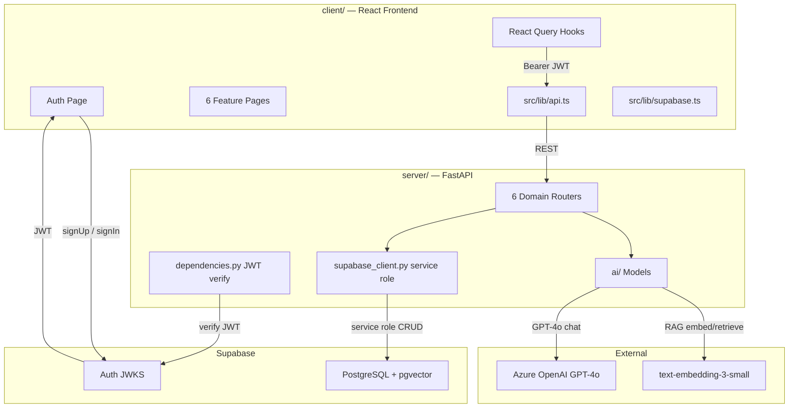

# CogniLearn — Full Implementation Plan

> Based on: DLW 2026 Jaijai Ideation Document + existing Lovable-generated React frontend  
> Stack: React (Vite) · FastAPI · Supabase (PostgreSQL + pgvector) · Azure OpenAI  
> Deadline: March 3, 2026 13:00 SGT

---

## What We Are Building

CogniLearn (LearnOS) is a cognitive AI study companion for university students. It diagnoses *why* a student gets answers wrong (not just that they did), personalises forgetting curves per student per topic, detects real-time attention and fatigue via webcam EAR, generates daily optimised study briefs, and explains concepts via voice-triggered RAG.

The frontend is already built (Lovable-generated, 6 pages). Everything is currently static mock data. This plan wires it to a real AI backend.

---

## System Architecture



**Key rule:** The frontend never touches the Supabase database directly. Supabase Auth JS is used only to obtain a JWT on login. Every FastAPI request carries that JWT as a `Bearer` token — FastAPI verifies it and performs all DB reads/writes using the service role key.

---

## Phase 0 — Repository Restructure

Move the existing frontend into `client/` and create the full judge-ready structure:

```
LearnOS-Microsoft-Track/
├── client/                   ← existing React app (moved here)
├── server/                   ← FastAPI backend (new)
├── data/                     ← synthetic datasets (new)
│   ├── generate_synthetic.py
│   ├── sample_interactions.json
│   └── curriculum_notes.json
├── notebooks/                ← Jupyter model training (new)
│   ├── error_classifier.ipynb
│   ├── forgetting_curve.ipynb
│   └── rag_testing.ipynb
├── testbench/                ← judge run guide (new)
│   └── README.md
├── docs/                     ← architecture diagrams (new)
├── PLAN.md                   ← this file
├── README.md
└── CITATIONS.md
```

---

## Phase 1 — Synthetic Data Generation

### `data/sample_interactions.json`

Script: `data/generate_synthetic.py`

Generate **1,000+ student interaction records**. Each record shape:

```json
{
  "student_id": "stu_001",
  "topic": "calc-integrals",
  "question_id": "q_042",
  "is_correct": false,
  "time_taken_seconds": 8,
  "attempt_number": 3,
  "timed_condition": true,
  "session_timestamp": "2026-02-20T10:15:00Z",
  "days_since_last_correct": 14,
  "cross_topic_ids": ["calc-derivatives"],
  "error_label": "misconception"
}
```

**6 error labels and their synthetic generation rules:**

| Label | Rule |
|---|---|
| `knowledge_gap` | accuracy < 30% on topic, low accuracy variance across attempts |
| `careless` | accuracy 70–90%, high variance, fast answer times |
| `misconception` | specific sub-pattern wrong consistently, fast + wrong answers |
| `transfer_failure` | correct on topic A and B in isolation, wrong when they appear together |
| `decay` | was correct 3+ weeks ago, now wrong (high `days_since_last_correct`) |
| `anxiety` | correct untimed, wrong timed (`timed_accuracy_delta > 30%`) |

### `data/curriculum_notes.json`

Static knowledge base of 25–30 concept explanations across all 5 subject groups (Calculus, Linear Algebra, Probability, Statistics, Differential Equations). Schema per entry:

```json
{ "topic_id": "calc-integrals", "title": "Integration by Parts", "content": "...", "prerequisites": ["calc-derivatives"] }
```

Used as the retrieval corpus for the RAG pipeline.

---

## Phase 2 — Model Training & AI Layer

### 2.1 Error Type Classifier

**Notebook:** `notebooks/error_classifier.ipynb`  
**Inference file:** `server/ai/error_classifier.py`

Aggregate interaction records into per-student-per-topic feature vectors:

| Feature | Computation |
|---|---|
| `accuracy` | correct / total attempts |
| `accuracy_variance` | std of rolling 5-attempt accuracy |
| `avg_time_correct` | mean seconds on correct answers |
| `avg_time_wrong` | mean seconds on wrong answers |
| `timed_accuracy_delta` | accuracy_untimed minus accuracy_timed |
| `days_since_last_correct` | temporal decay signal |
| `cross_topic_error_rate` | error rate on prerequisite topics |

**Model:** XGBoost multi-class classifier (6 classes).  
Chosen because it handles tabular features well, natively supports multi-class, and SHAP values are first-class — directly feeding the existing SHAP panel in `CognitiveFingerprint.tsx`.

**Training steps:**

1. Load `data/sample_interactions.json`, aggregate to feature vectors per student-topic
2. `train_test_split(test_size=0.2)`
3. `XGBClassifier(n_estimators=200, max_depth=4, objective="multi:softmax", num_class=6)`
4. Evaluate: overall accuracy + per-class F1 score
5. `joblib.dump(model, "server/ai/models/error_classifier.pkl")`
6. `shap.TreeExplainer(model)` — save for per-prediction SHAP computation at inference time

**Output shape** (matches existing `shapExplanations` mock data exactly):

```json
{
  "error_type": "misconception",
  "shap_values": [
    { "feature": "avg_time_wrong", "impact": 0.34, "direction": "negative" },
    { "feature": "timed_accuracy_delta", "impact": 0.28, "direction": "negative" }
  ]
}
```

---

### 2.2 Personalised Forgetting Curve

**Notebook:** `notebooks/forgetting_curve.ipynb`  
**File:** `server/ai/forgetting_curve.py`

Ebbinghaus exponential decay model: `R(t) = e^(-t / S)` where `S` is the retention stability constant, fitted **per student per topic** using their actual historical data.

**Steps:**

1. From interaction records, extract `(days_since_first_correct, is_correct)` time series per student-topic
2. Use `scipy.optimize.curve_fit` to fit `S` for each pair
3. Store fitted `S` and `last_correct_at` in Supabase `topic_stability` table
4. On each `GET /study/brief` request, compute `risk_score = 1 - e^(-days_elapsed / S)` and sort topics by urgency
5. Assign decay label: `S < 5` days = fast, `5–14` = moderate, `> 14` = slow

**Output** (matches `riskTopics` mock shape exactly):

```json
[
  { "topic": "Integration by Parts", "risk": 0.89, "decay": "fast", "nextReview": "Today" },
  { "topic": "Taylor Series", "risk": 0.76, "decay": "moderate", "nextReview": "Today" }
]
```

---

### 2.3 EAR Fatigue Detector

**File:** `server/ai/ear_processor.py`

**No model training required** — uses MediaPipe Face Mesh (pretrained 468-landmark model, ships with the `mediapipe` pip package).

Eye Aspect Ratio formula (Soukupová & Čech, 2016):

```
EAR = ( ||p2−p6|| + ||p3−p5|| ) / ( 2 × ||p1−p4|| )
```

**Implementation:**

1. `POST /attention/frame` receives a base64-encoded webcam frame
2. Run MediaPipe Face Mesh on the decoded image (no GPU required)
3. Extract eye landmark indices — left eye: `[362, 385, 387, 263, 373, 380]`, right eye: `[33, 160, 158, 133, 153, 144]`
4. Compute EAR for both eyes, take the average
5. Classify state: `EAR > 0.25` = focused, `0.21–0.25` = engaged, `< 0.21` = drowsy (PERCLOS standard threshold)
6. Fatigue score = rolling 30-frame weighted average of `max(0, 0.25 − EAR) × 400`, clamped 0–100
7. Return `{ ear, state, fatigue_score }` — **frames are never written to disk** (privacy requirement per ideation doc: "auto delete images but save study statistics")

**Frontend integration:** `AttentionMonitor.tsx` captures webcam frames via `navigator.mediaDevices.getUserMedia`, encodes as base64, sends to `POST /attention/frame` every 1.5s, and renders the returned live `ear` and `fatigue_score` values (replacing the current fake `setInterval` simulation).

---

### 2.4 RAG Pipeline — TeachMe Voice

**Notebook:** `notebooks/rag_testing.ipynb`  
**File:** `server/ai/rag_pipeline.py`

**One-time embedding setup** (run via `python server/ai/rag_pipeline.py --seed`):

1. Load `data/curriculum_notes.json`
2. Call Azure `text-embedding-3-small` to embed each note (1536-dim vectors)
3. Store in Supabase `curriculum_embeddings` table using the `pgvector` extension (`vector(1536)` column)

**Per-request inference flow:**

1. Receive voice transcript from the frontend (Web Speech API `SpeechRecognition` result)
2. Embed the transcript with the same `text-embedding-3-small` model
3. Cosine similarity search in Supabase: `SELECT * FROM curriculum_embeddings ORDER BY embedding <=> $query_vec LIMIT 3`
4. Augment GPT-4o system prompt: include retrieved curriculum context + student's transcript
5. GPT-4o returns a personalised explanation; parse keywords from its output
6. Return `{ response, keywords: [{ word, relevance, isGap }], relatedConcepts }` — matches `extractedKeywords` + `ragExplanation` mock shapes exactly

---

### 2.5 Study Brief Optimizer

**File:** `server/ai/study_optimizer.py`

**Priority scoring per topic:**

```python
priority = risk_score * decay_urgency_multiplier * exam_proximity_weight
# risk_score              → from forgetting curve output (0–1)
# decay_urgency_multiplier → 1 + (decay_rate − 0.5)  — fast decayers get boosted
# exam_proximity_weight   → 1 / max(1, days_until_exam)
```

**Schedule generation algorithm:**

1. Sort topics by priority score (descending)
2. Greedily assign 30–90 min time blocks into available daily windows
3. Insert Pomodoro-style breaks every 90 minutes (`block_type: "break"`)
4. Tag each block type by the diagnosed error type:
   - misconception → `"deep"` (targeted concept correction)
   - careless → `"deep"` (timed drill practice)
   - decay → `"light"` (spaced retrieval review)
5. Output matches `deepWorkWindows` mock shape: `{ start, end, type, topic }`

---

## Phase 3 — Supabase Database Schema

Enable the `pgvector` extension first, then create all tables via the Supabase SQL editor:

```sql
-- Enable vector search
CREATE EXTENSION IF NOT EXISTS vector;

-- Error classification history
CREATE TABLE cognitive_sessions (
  id           uuid DEFAULT gen_random_uuid() PRIMARY KEY,
  user_id      uuid REFERENCES auth.users NOT NULL,
  topic        text NOT NULL,
  error_type   text NOT NULL,  -- knowledge_gap | careless | misconception | transfer_failure | decay | anxiety
  accuracy     float NOT NULL,
  shap_values  jsonb,
  created_at   timestamptz DEFAULT now()
);

-- Personalised forgetting curve parameters
CREATE TABLE topic_stability (
  id              uuid DEFAULT gen_random_uuid() PRIMARY KEY,
  user_id         uuid REFERENCES auth.users NOT NULL,
  topic_id        text NOT NULL,
  stability_s     float NOT NULL,   -- Ebbinghaus S constant (days)
  last_correct_at timestamptz,
  updated_at      timestamptz DEFAULT now()
);

-- AI-generated daily schedules
CREATE TABLE study_schedules (
  id               uuid DEFAULT gen_random_uuid() PRIMARY KEY,
  user_id          uuid REFERENCES auth.users NOT NULL,
  date             date NOT NULL,
  subject          text,
  start_time       text,
  end_time         text,
  duration_minutes int,
  block_type       text,           -- deep | break | light
  topic_id         text
);

-- Per-user knowledge graph nodes
CREATE TABLE knowledge_nodes (
  id         uuid DEFAULT gen_random_uuid() PRIMARY KEY,
  user_id    uuid REFERENCES auth.users NOT NULL,
  topic_id   text NOT NULL,
  label      text,
  group_name text,
  mastery    float,
  risk_level text
);

-- Knowledge graph edges (prerequisite relationships)
CREATE TABLE knowledge_edges (
  id        uuid DEFAULT gen_random_uuid() PRIMARY KEY,
  user_id   uuid REFERENCES auth.users NOT NULL,
  source_id text,
  target_id text,
  strength  float
);

-- Webcam attention/fatigue readings
CREATE TABLE attention_logs (
  id            uuid DEFAULT gen_random_uuid() PRIMARY KEY,
  user_id       uuid REFERENCES auth.users NOT NULL,
  ear_value     float,
  state         text,              -- focused | engaged | drowsy
  fatigue_score float,
  recorded_at   timestamptz DEFAULT now()
);

-- TeachMe Voice RAG sessions
CREATE TABLE voice_sessions (
  id               uuid DEFAULT gen_random_uuid() PRIMARY KEY,
  user_id          uuid REFERENCES auth.users NOT NULL,
  transcript       text,
  response         text,
  keywords         jsonb,
  related_concepts text[],
  created_at       timestamptz DEFAULT now()
);

-- Curriculum notes with embeddings (shared, no user_id)
CREATE TABLE curriculum_embeddings (
  id        uuid DEFAULT gen_random_uuid() PRIMARY KEY,
  topic_id  text,
  title     text,
  content   text,
  embedding vector(1536)
);
```

**RLS policy** (apply to all user tables):

```sql
ALTER TABLE <table> ENABLE ROW LEVEL SECURITY;
CREATE POLICY "Users own their data" ON <table>
  FOR ALL USING (auth.uid() = user_id);
```

FastAPI uses the `SUPABASE_SERVICE_ROLE_KEY` which bypasses RLS automatically.

---

## Phase 4 — FastAPI Backend (`server/`)

```
server/
├── main.py                    ← app factory, CORS config, router registration
├── dependencies.py            ← get_current_user() — decode Supabase JWT, return user_id str
├── supabase_client.py         ← supabase-py client initialised with SUPABASE_SERVICE_ROLE_KEY
├── routers/
│   ├── cognitive.py           ← GET /cognitive · POST /cognitive/session
│   ├── study.py               ← GET /study/brief · POST /study/session
│   ├── knowledge.py           ← GET /knowledge/graph
│   ├── attention.py           ← GET /attention/history · POST /attention/frame
│   ├── voice.py               ← POST /voice/process
│   └── mydata.py              ← GET /mydata/export · DELETE /mydata/{table}
├── ai/
│   ├── models/                ← error_classifier.pkl (trained artifact, gitignored if large)
│   ├── error_classifier.py    ← load pkl · predict error type · compute SHAP values
│   ├── forgetting_curve.py    ← fit Ebbinghaus S · compute current risk scores
│   ├── ear_processor.py       ← MediaPipe Face Mesh · EAR calculation · state + fatigue
│   ├── rag_pipeline.py        ← embed · pgvector search · GPT-4o prompt augmentation
│   └── study_optimizer.py     ← priority scoring · greedy schedule packing
├── .env                       ← secrets (never committed)
└── requirements.txt
```

**`requirements.txt` packages:**

```
fastapi
uvicorn[standard]
supabase
openai
xgboost
shap
joblib
mediapipe
scipy
numpy
python-jose[cryptography]
python-dotenv
Pillow
```

**API contract** — all response shapes intentionally mirror existing `mockData.ts` to minimise frontend rewrites:

| Endpoint | Response shape |
|---|---|
| `GET /cognitive` | `{ errorTypeRadar, topicBreakdown, shapExplanations, forgettingCurveData }` |
| `GET /study/brief` | `{ riskTopics, deepWorkWindows, momentumState }` |
| `GET /knowledge/graph` | `{ nodes: GraphNode[], links: GraphLink[] }` |
| `GET /attention/history` | `{ attentionStates, currentAttention, fatigueAlerts }` |
| `POST /attention/frame` | `{ ear, state, fatigue_score }` |
| `POST /voice/process` | `{ extractedKeywords, ragExplanation }` |
| `GET /mydata/export` | Full data JSON dump |
| `DELETE /mydata/{table}` | 204 No Content |

**`server/.env`:**

```
SUPABASE_URL=https://xxx.supabase.co
SUPABASE_SERVICE_ROLE_KEY=eyJ...
AZURE_OPENAI_ENDPOINT=https://xxx.openai.azure.com
AZURE_OPENAI_KEY=xxx
AZURE_OPENAI_DEPLOYMENT=gpt-4o
AZURE_EMBEDDING_DEPLOYMENT=text-embedding-3-small
```

---

## Phase 5 — Frontend Integration (`client/`)

### New files to create

| File | Purpose |
|---|---|
| `client/src/lib/supabase.ts` | Supabase Auth JS client using `VITE_SUPABASE_URL` + `VITE_SUPABASE_ANON_KEY` |
| `client/src/lib/api.ts` | Typed `apiFetch<T>()` wrapper — reads current session JWT, sends `Authorization: Bearer` |
| `client/src/pages/Auth.tsx` | Email/password login + signup form |
| `client/src/hooks/api/useCognitiveData.ts` | `useQuery` → `GET /cognitive` |
| `client/src/hooks/api/useStudyData.ts` | `useQuery` → `GET /study/brief` |
| `client/src/hooks/api/useKnowledgeGraph.ts` | `useQuery` → `GET /knowledge/graph` |
| `client/src/hooks/api/useAttentionData.ts` | `useQuery` → `GET /attention/history` + frame mutation |
| `client/src/hooks/api/useVoiceSession.ts` | `useMutation` → `POST /voice/process` |
| `client/src/hooks/api/useMyData.ts` | `useQuery` + mutations → export/delete |

### Files to modify

| File | Change |
|---|---|
| `client/src/App.tsx` | Add `/auth` route + `ProtectedRoute` wrapper around all 6 page routes |
| `client/src/components/Layout.tsx` | Add user avatar + logout button to sidebar footer |
| `client/src/pages/CognitiveFingerprint.tsx` | Replace 4 `mockData` imports with `useCognitiveData()` |
| `client/src/pages/StudyBrief.tsx` | Replace 3 `mockData` imports with `useStudyData()` |
| `client/src/pages/KnowledgeGraph.tsx` | Replace node/link arrays with `useKnowledgeGraph()` |
| `client/src/pages/AttentionMonitor.tsx` | Remove `setInterval` fake loop → add `getUserMedia` webcam capture → `POST /attention/frame` every 1.5s |
| `client/src/pages/TeachMeVoice.tsx` | Remove `setTimeout` fake → `window.SpeechRecognition` → on `onend` call `POST /voice/process` |
| `client/src/pages/MyData.tsx` | Wire export and delete buttons to `useMyData()` mutations |

`client/src/data/mockData.ts` — kept as seed/reference, no longer imported by any page.

### `client/.env.local`

```
VITE_SUPABASE_URL=https://xxx.supabase.co
VITE_SUPABASE_ANON_KEY=eyJ...
VITE_API_URL=http://localhost:8000
```

---

## Phase 6 — Testbench (`testbench/README.md`)

Judge-facing step-by-step instructions to run the full stack from scratch on a clean machine:

1. **Prerequisites:** Node 20+, Python 3.11+, Supabase account (free tier), Azure for Students credits ($100)
2. Clone the repo and install dependencies:
   ```bash
   cd client && npm install
   cd ../server && pip install -r requirements.txt
   ```
3. Copy `.env` files and fill in keys
4. Run the Supabase SQL schema script in the dashboard SQL editor
5. Seed synthetic data: `python data/generate_synthetic.py`
6. Train the error classifier: `jupyter nbconvert --to notebook --execute notebooks/error_classifier.ipynb`
7. Seed curriculum embeddings: `python server/ai/rag_pipeline.py --seed`
8. Start servers:
   ```bash
   # Terminal 1
   cd server && uvicorn main:app --reload

   # Terminal 2
   cd client && npm run dev
   ```
9. Open `http://localhost:8080`, sign up with any email, and explore all 6 pages

---

## Implementation Sequence

```mermaid
gantt
    title Implementation Timeline
    dateFormat X
    axisFormat Day %s

    section Data and Models
    Repo restructure               :a0, 0, 1
    Synthetic data generation      :a1, 1, 2
    Error classifier training      :a2, 2, 4
    Forgetting curve impl          :a3, 1, 3
    EAR processor impl             :a4, 1, 3
    RAG pipeline and embed seed    :a5, 3, 5

    section Backend
    Supabase schema                :b1, 1, 2
    FastAPI scaffold and auth dep  :b2, 1, 2
    All 6 domain routers           :b3, 2, 4
    AI layer wiring into routers   :b4, 4, 5

    section Frontend
    Auth page and protected routes :c1, 2, 3
    API client and 6 hooks         :c2, 3, 4
    Page wiring (mockData removal) :c3, 4, 5
    Webcam EAR and Speech API      :c4, 4, 5

    section Docs
    Testbench README               :d1, 5, 6
    CITATIONS.md                   :d2, 5, 6
```



---

## Checklist

- [ ] Phase 0 — Repo restructured into judge-ready layout
- [ ] Phase 1 — Synthetic dataset generated (1,000+ records, 6 error labels)
- [ ] Phase 2.1 — Error classifier trained, `.pkl` exported, SHAP working
- [ ] Phase 2.2 — Forgetting curve fitter implemented, `S` values stored in Supabase
- [ ] Phase 2.3 — EAR fatigue detector working with MediaPipe (webcam input, no frame storage)
- [ ] Phase 2.4 — RAG pipeline seeded, `POST /voice/process` returning real GPT-4o explanations
- [ ] Phase 2.5 — Study brief optimizer generating real schedules
- [ ] Phase 3 — All 8 Supabase tables created with RLS
- [ ] Phase 4 — FastAPI running locally with all 6 routers returning correct shapes
- [ ] Phase 5 — All 6 frontend pages wired to real API, no more mockData imports
- [ ] Phase 5 — Auth flow working (signup → JWT → protected routes)
- [ ] Phase 5 — Webcam EAR live in AttentionMonitor, Speech API live in TeachMeVoice
- [ ] Phase 6 — Testbench README verified on a clean machine
